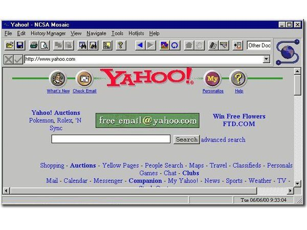

# JavaScript

## Première partie

### C'est quoi Javascript ?

Le JavaScript est un langage de programmation essentiel dans le développement web, au même titre que HTML et CSS. En tant que développeur, il est quasiment inévitable de devoir manipuler du JavaScript à un moment ou à un autre de son parcours. La maîtrise du JavaScript, ou tout au moins de ses concepts fondamentaux, permet de devenir un développeur complet capable de résoudre une multitude de problèmes. JavaScript, ou "JS" pour les intimes, offre des capacités variées, comme la création d'animations et d'interactions dynamiques sur les sites web, ou encore la récupération et l'affichage de données.
Pour vous donner une idée de son importance, voici à quoi ressemblait le premier [Site internet](https://info.cern.ch/hypertext/WWW/TheProject.html).
Et voici à quoi ressemblait [Yahoo](https://fr.yahoo.com/) (Google de l'époque) avant l'arrivée du Javascript (et de [Flash](https://fr.wikipedia.org/wiki/Adobe_Flash_Player)).
 

#### La Relation entre JavaScript, HTML et CSS

HTML (HyperText Markup Language) est le langage de base pour structurer le contenu des pages web. CSS (Cascading Style Sheets) est utilisé pour styliser et mettre en forme ce contenu. JavaScript vient compléter ces deux technologies en ajoutant une couche de dynamisme et d'interactivité. Voici comment ces trois langages travaillent ensemble :

- **HTML** : définit la structure de la page web avec des balises et des éléments.
- **CSS** applique des styles à ces éléments HTML pour améliorer leur apparence.
- **JavaScript** ajoute des fonctionnalités interactives et dynamiques à ces éléments HTML.

#### Exemples d'Utilisation de JavaScript

1. **Animations et Interactions** :
   JavaScript permet de créer des animations sophistiquées et des interactions réactives. Par exemple, des menus déroulants, des carrousels d'images, et des effets de transition. Les bibliothèques comme jQuery simplifient la manipulation du DOM (Document Object Model) pour ces fins.
   On aura l'occasion de voir d'autres librairies un peu plus tard dans le cours comme GSAP ou Three JS qui permettent d'amener l'animation à un autre niveau.

2. **Validation de Formulaire** :
   Avant d'envoyer des données à un serveur, JavaScript peut être utilisé pour valider les entrées utilisateur. Par exemple, vérifier que tous les champs obligatoires sont remplis, ou que l'adresse e-mail a un format correct.

3. **Récupération de Données (AJAX)** :
   JavaScript permet d'effectuer des requêtes HTTP asynchrones avec AJAX (Asynchronous JavaScript and XML). Cela permet de récupérer des données à partir d'un serveur sans recharger la page, offrant une meilleure expérience utilisateur. Par exemple, charger dynamiquement des contenus supplémentaires à partir d'une API sans nécessiter un rechargement complet de la page.

4. **Frameworks et Bibliothèques** :
   Des frameworks comme React, Angular et Vue.js sont basés sur JavaScript et facilitent le développement d'applications web complexes et performantes. Ils permettent de structurer le code de manière modulaire et réutilisable.

5. **Gestion d'Événements** :
   JavaScript peut réagir aux événements déclenchés par l'utilisateur, tels que les clics, les survols de souris, ou les frappes au clavier. Par exemple, afficher un message lorsque l'utilisateur clique sur un bouton ou changer la couleur d'un élément lorsqu'il passe la souris dessus.

#### Conclusion

En somme, le JavaScript est un langage indispensable pour tout développeur web souhaitant créer des sites interactifs et dynamiques. Sa maîtrise ouvre la porte à un développement web plus riche et plus fonctionnel, permettant de répondre aux exigences des utilisateurs modernes. Que ce soit pour de simples animations ou des applications web complexes, JavaScript joue un rôle central dans l'écosystème du développement web.

### TypeScript, c'est quoi ?

En plus de JavaScript, il existe une technologie alternative appelée TypeScript, que vous pouvez choisir d'explorer. TypeScript est un sur-ensemble de JavaScript développé par Microsoft qui ajoute des types statiques au langage. Bien que l'écriture en TypeScript puisse sembler un peu plus lourde, elle offre de nombreux avantages, notamment en matière de gestion des erreurs. En réalité, TypeScript n'est pas lu comme du JavaScript par le navigateur, mais il nécessite une compilation avant de pouvoir être interprété.

#### Compilation en TypeScript

La compilation est un processus par lequel le code TypeScript est transformé en code JavaScript standard, lisible par les navigateurs web. Voici comment cela fonctionne et pourquoi c'est important :

1. **Transpilation** :
   - **Transpilation vs Compilation** : TypeScript utilise un processus appelé "transpilation" pour convertir le code TypeScript en JavaScript. Cela signifie que le code est traduit d'un langage de haut niveau (TypeScript) en un autre langage de haut niveau (JavaScript), contrairement à la compilation classique qui traduit un langage de haut niveau en langage machine.
   - **tsc (TypeScript Compiler)** : TypeScript est livré avec son propre compilateur, `tsc`, qui effectue cette conversion. En exécutant la commande `tsc`, le compilateur analyse le code TypeScript, vérifie les types, et génère le fichier JavaScript correspondant.

2. **Phases de Compilation** :
   - **Analyse et Vérification des Types** : Le compilateur `tsc` analyse le code pour détecter les erreurs de type. Si des erreurs sont détectées, elles sont signalées et doivent être corrigées avant que le code puisse être transpiler avec succès.
   - **Génération de Code** : Une fois le code vérifié, le compilateur génère le fichier JavaScript équivalent, prêt à être exécuté dans n'importe quel navigateur ou environnement compatible avec JavaScript.

3. **Configuration de la Compilation** :
   - **tsconfig.json** : TypeScript utilise un fichier de configuration `tsconfig.json` pour définir les options de compilation, comme les chemins des fichiers source, les options de sortie, et les règles strictes de vérification des types. Cela permet de personnaliser le processus de compilation en fonction des besoins spécifiques du projet.

#### Les Avantages de la Compilation TypeScript

1. **Détection des Erreurs en Amont** :
   - **Erreurs de Compilation** : La compilation permet de détecter les erreurs de type et de syntaxe avant même que le code ne soit exécuté. Cela signifie que de nombreux bugs peuvent être corrigés tôt dans le cycle de développement, ce qui réduit le nombre d'erreurs en production.
   - **Type Safety** : En ajoutant des types statiques, TypeScript aide à prévenir les erreurs courantes comme les erreurs de typage, les accès à des propriétés inexistantes, et les appels de fonctions avec des arguments incorrects.

2. **Amélioration de la Productivité** :
   - **Auto-complétion et IntelliSense** : Les outils de développement, comme Visual Studio Code, utilisent les types pour offrir une auto-complétion intelligente et des suggestions de code. Cela rend le développement plus rapide et plus précis.
   - **Refactoring Sécurisé** : Grâce aux types, le refactoring du code est plus sûr. Les outils peuvent détecter les usages incorrects des fonctions ou des variables après les modifications, ce qui facilite la maintenance du code.

3. **Interopérabilité et Évolutivité** :
   - **Compatibilité JavaScript** : Puisque TypeScript est un sur-ensemble de JavaScript, il est compatible avec toutes les bibliothèques et frameworks JavaScript existants. Vous pouvez adopter TypeScript progressivement, fichier par fichier, dans un projet JavaScript existant.
   - **Écosystème TypeScript** : De nombreuses bibliothèques modernes sont écrites en TypeScript ou fournissent des définitions de types, ce qui facilite leur intégration dans les projets TypeScript.

#### Exemples de Code

Voici un exemple simple pour illustrer les différences entre JavaScript et TypeScript :

**JavaScript :**

```javascript
function add(a, b) {
    return a + b;
}

console.log(add(2, 3)); // 5
console.log(add(2, "3")); // "23" (comportement inattendu)
```

**TypeScript :**

```typescript
function add(a: number, b: number): number {
    return a + b;
}

console.log(add(2, 3)); // 5
console.log(add(2, "3")); // Erreur de compilation (comportement sécurisé)
```

 

**Le code ci dessus va fonctionner si on le teste dans une "sandbox", mais si on essaye de le compiler avec la commande `tsc` le compilateur nous renverra une erreur pour le dernier `console.log` Typescript dispose d'un outil qui permet d'identifier les causes probables des erreurs, vous pouvez le trouver [ici](https://ts-error-translator.vercel.app/)**

#### Conclusion

TypeScript est une technologie puissante qui apporte des avantages significatifs par rapport à JavaScript, en particulier en termes de gestion des erreurs et de maintenabilité du code. Bien que l'écriture en TypeScript puisse sembler un peu plus lourde, les bénéfices de la compilation et des types statiques en valent largement la peine. En explorant TypeScript, vous pouvez améliorer la qualité de votre code et devenir un développeur plus efficace et productif. Si vous souhaitez améliorer la fiabilité et la maintenabilité de vos projets, il est fortement recommandé de vous intéresser à TypeScript.
